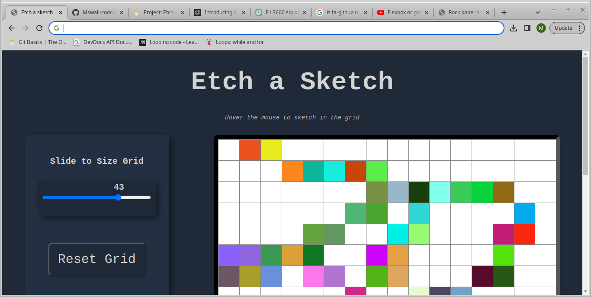

# Etch-a-Sketch Project

A simple Etch-a-Sketch web application built using HTML, CSS, and JavaScript. You can create sketches by hovering over grid squares.Part of the odin's project curriculum.

## Features
- Interactive grid for sketching
- Resize the grid to different dimensions
- Reset button to clear the sketch

## Demo
 

